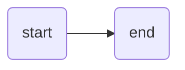

# reveal-ck
## tutorial

by Sven / @sohooo

---

i :heart: reveal.js

---

### Setup

install:

```bash
```

```yaml
# config.yml
theme: night
transition: fade
title: testing reveal-ck
author: sohooo
```

---

### Usage

```bash
# generates slides/
reveal-ck generate

# live hosting
reveal-ck serve
```

---

### Keys

key   | desc
---   | ----
<- -> | move between slides
esc   | toggle overview
s     | speaker mode

```note
content needs to be valid `us-ascii`
```

---


Look, images!


```note
This is a speaker note. It's only visible in presentation mode.

Activate presentation mode by pressing 's'.

Presentation mode only works when your slides are viewed on a
webserver. reveal-ck comes with one if you need it.
```

---

## how about some mermaids?



---

this is some code:

```ruby
["do", "dont do"].include? "try"
#=> false
```

---

# important

- this thing
- that thing
- the other thing too


---

sweeet! :muscle:

